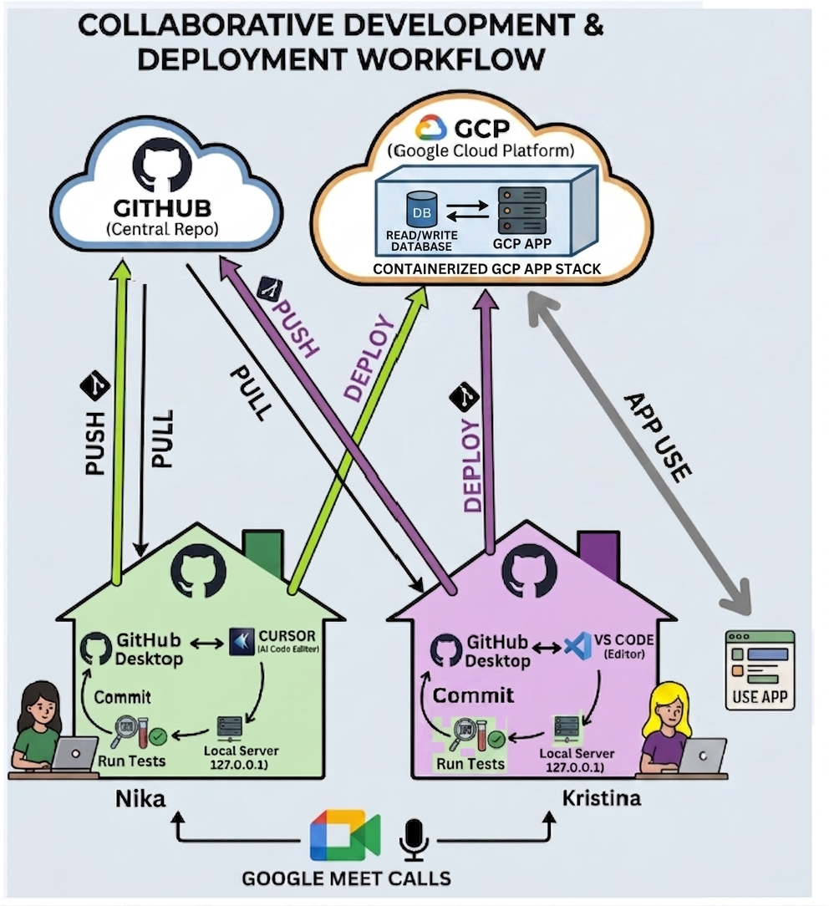

# Development Process

This page describes how the Fintom8 team collaborates to build and ship a feature end-to-end, using the "orders" button as a concrete example.

---

## Phase 1: Planning and Branch Creation

1. **Coordination** — Nika (Frontend) and Kristina (Backend) sync via a Google Meet call to align on the design and functional requirements of the feature.
2. **Branch setup:**
    - Either Nika or Kristina creates a new branch named `order-button-feature` locally.
    - Using **GitHub Desktop**, they publish this branch to the central GitHub repository.
    - The other developer then uses GitHub Desktop to pull the `order-button-feature` branch so both are working on the same branch.

---

## Phase 2: Frontend Design (Nika)

1. **Local development** — Nika only needs to start the **frontend server** (Next.js):
    ```bash
    npm run dev
    ```
    The frontend runs at `http://localhost:3000`. No backend server is required for UI-only changes.
2. **Code editing** — She opens the project in **VScode or Cursor (AI Code Editor)** and implements the visual design adjustments for the "orders" button.
3. **Local testing** — She runs the application locally to verify that the UI updates display correctly.
4. **Git commit & push:**
    - Once satisfied, Nika runs the local test suite to make sure nothing is broken.
    - She opens **GitHub Desktop** to commit her frontend changes with a descriptive message.
    - She pushes the committed changes to the shared `order-button-feature` branch on GitHub.

---

## Phase 3: Backend Functionality (Kristina)

1. **Pulling updates** — Using GitHub Desktop, Kristina pulls the latest updates from the `order-button-feature` branch to get Nika's frontend changes.
2. **Local development** — Kristina must start **both servers** to test the full integration:
    - **Backend** (Node.js) — in one terminal:
        ```bash
        npm run start
        ```
        Runs at `http://localhost:5000` (or the configured port).
    - **Frontend** (Next.js) — in a second terminal:
        ```bash
        npm run dev
        ```
        Runs at `http://localhost:3000` and proxies API calls to the backend.
3. **Code editing** — She opens the project in **VS Code** to write and adjust the backend functionality (e.g. API endpoints, database queries).
4. **Local integration testing** — She verifies that Nika's frontend design integrates correctly with the new backend logic.
5. **Git commit & push:**
    - After running and passing local tests, Kristina opens GitHub Desktop.
    - She commits her backend changes and pushes them to the `order-button-feature` branch on GitHub.
    - If further adjustments are needed, they continue iterating and communicating via Google Meet.

---

## Phase 4: Review and Merging (Igor)

1. **Pull Request creation** — Once both design and functionality are fully tested locally, Kristina creates a **Pull Request (PR)** on GitHub from `order-button-feature` to the target branch (`main` or `develop`).
2. **Code review** — Igor reviews the PR to ensure the code meets the team's standards.
3. **Merge** — After Igor approves the PR, the changes are merged into the main branch.

---

## Phase 5: Deployment to GCP (Cloud Run)

1. **Preparation** — Kristina uses GitHub Desktop to pull the newly merged code from the `main` branch to her local environment.
2. **Deployment** — Kristina triggers the deployment process to **Google Cloud Platform (GCP)**.
3. **Containerised execution** — The application is packaged and deployed as a containerised app running on **GCP Cloud Run**, which communicates directly with the Read/Write Database in the GCP environment.
4. **App goes live** — The updated application is available to end-users, who can now interact with the redesigned and fully functional "orders" button.
