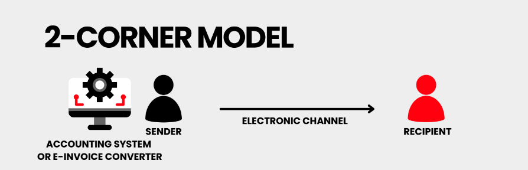
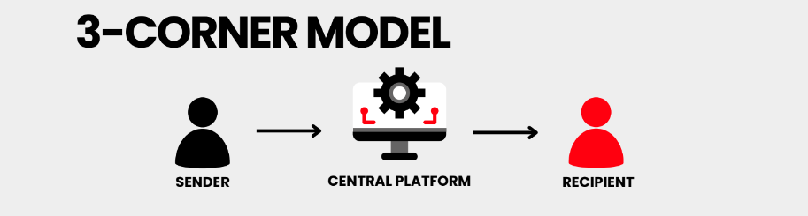
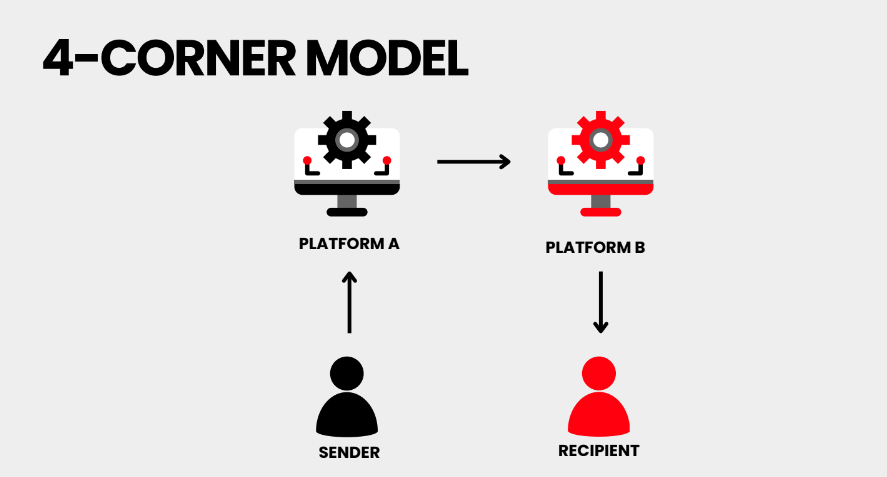
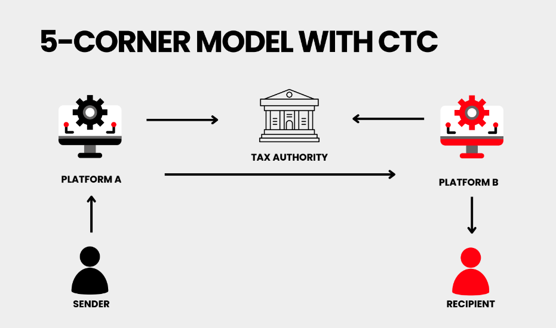

# E-Invoicing Corner Models

## How electronic invoices move between businesses

Corner Models show **who is involved in sending and receiving an electronic invoice**.

There are four main models:

**2-Corner → 3-Corner → 4-Corner → 5-Corner**

Each model adds another part to the invoice exchange process.

## What is a Corner Model?

A Corner Model is a simple way to describe **how an electronic invoice moves from the seller to the buyer**.

The "corners" represent the different parties or systems involved.

The more corners a model has, the more the process can support **automation, interoperability, and tax reporting**.

## 2-Corner Model

The simplest model.

The **supplier sends an invoice directly to the buyer**.

The buyer can receive the invoice directly into their Accounts Payable system. A supplier can also use the buyer's portal to submit an invoice.

**Good for:**

- Direct invoice exchange
- Simple business relationships
- Companies with a small number of partners

## 3-Corner Model

A **service provider** is added between the buyer and supplier.

The provider receives invoices, processes them and sends them to the right company.

Invoices can arrive in different formats, such as **PDF or XML**, and can be converted into the format needed by the buyer. AI can also help extract invoice data.

**Good for:**

- Invoice processing
- Data extraction
- Format conversion
- Validation
- Easier integration

## 4-Corner Model

In this model, **both the buyer and supplier can have their own service provider**.

The two providers communicate with each other and exchange the invoice.

This means companies do not need to build a separate connection with every business partner.

**Main benefit:**

### Interoperability

Different providers can work together using common standards and communication rules.

## 5-Corner Model

The 5-Corner Model adds the **tax authority**.

The invoice is still exchanged between the service providers. But a selected part of the invoice data is also sent to the tax authority.

This allows countries to combine:

**Business automation + Invoice exchange + Tax reporting**

Only certified service providers connect to the tax authority platform.

## Why Corner Models Matter

E-invoicing is not only about sending an invoice.

The invoice must also contain **correct and usable data**.

For example, an invoice may arrive as a PDF or XML, but the data can still be incomplete, incorrectly structured or not ready for an ERP system.

This is where **Pre-ERP Intelligence** becomes important.

Fintom8 helps prepare invoice data before it enters the ERP:

**Classify → Extract → Convert → Validate → Correct → Match → Audit**

## Quick Overview

| Model | How it works | Main benefit |
| --- | --- | --- |
| **2-Corner** | Buyer ↔ Supplier | Direct exchange |
| **3-Corner** | Buyer/Supplier ↔ Provider | Easier processing |
| **4-Corner** | Provider ↔ Provider | Interoperability |
| **5-Corner** | Provider ↔ Provider + Tax Authority | Tax reporting |

## From direct exchange to connected networks

**2-Corner** keeps invoice exchange simple.

**3-Corner** adds a service provider.

**4-Corner** connects different providers.

**5-Corner** adds tax authority reporting.