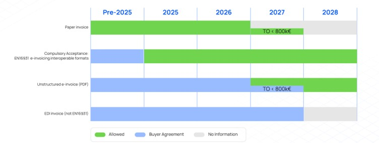
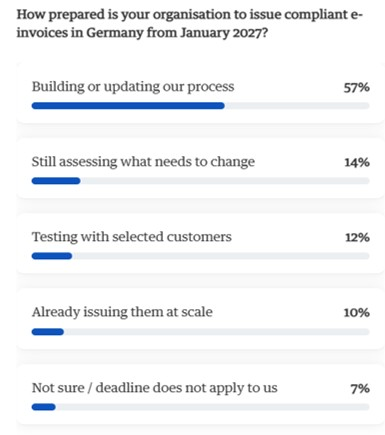
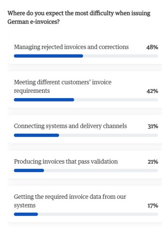
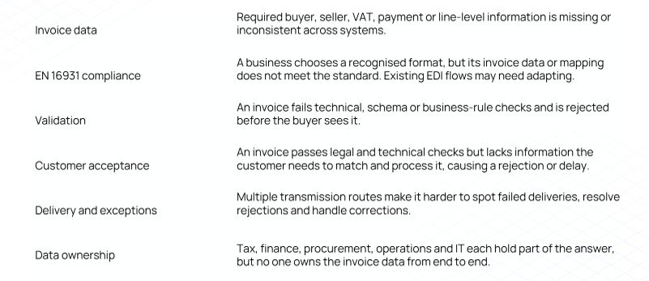

# Summary of the Ecosio webinar: Germany's 2027 e-invoicing mandate

## **Context and timeline**

From 1 January 2027, German businesses with prior-year turnover above €800,000 must issue structured e-invoices for domestic B2B transactions. Receiving e-invoices has been mandatory since 1 January 2025\. Outbound e-invoicing stays voluntary until 31 December 2026\. From 1 January 2028, it becomes mandatory for all domestic B2B, and PDF and paper no longer count as standard invoices. 

Key parameters are:

* **Scope:** domestic B2B.  
* **Tax authority:** the Federal Ministry of Finance (BMF).  
* **Model:** interoperability with post-audit.  
* **Format:** EN 16931-conformant.  
* **E-signature:** not required.  
* **Archiving:** 8 years.

An opening poll showed 57% of attendees are still building or updating their process, and only 10% already issue e-invoices at scale. 

## EN 16931 as the compliance reference

This European standard defines the data fields of an e-invoice (a semantic model) and is implemented through the UBL 2.1 and CII D16B syntaxes. Accepted formats include XRechnung, Peppol BIS 3.0, ZUGFeRD and CII, plus EDIFACT once adapted to EN 16931\. The standard covers invoice types such as credit notes, partial and final invoices and corrections, and German-specific fields. Invoice data (header, partner, lines, VAT) must be prepared in structured form.

## Validation as the enforcement layer

Every invoice is checked in three steps: well-formedness, schema conformance, and business rules via Schematron. Invoices that fail are rejected, even before the buyer sees them.

## Legally valid is not the same as commercially accepted

VAT law and EN 16931 set only the baseline. Buyers want automated matching and exception-free posting, so a compliant invoice can still be rejected or delayed. In a poll, the biggest expected difficulties were managing rejections and corrections (48%) and meeting different customers' requirements (42%).

Data governance enables scale

Most problems come from fragmented data rather than technology. Only 24% of attendees have shared responsibility with clear handovers, and 49% have shared responsibility with gaps. Finance, tax, sales, procurement, operations and IT each hold part of the data. The remedy is central governance built on:

\- clear data ownership

\- defined source systems

\- documented customer-specific rules

Where businesses are exposed

The webinar ended with a readiness checklist spreadsheet that evaluates an organisation across 11 areas:

* scope and impact

* regulatory readiness

* governance

* data readiness

* people and capability readiness

* process readiness

* technology readiness

* controls and risk readiness

* delivery model

* testing

* monitoring and auditability

---

## News Source

[Germany plans](https://www.vatcalc.com/germany/germany-bmf-targets-july-2030-vat-e-reporting-launch/)